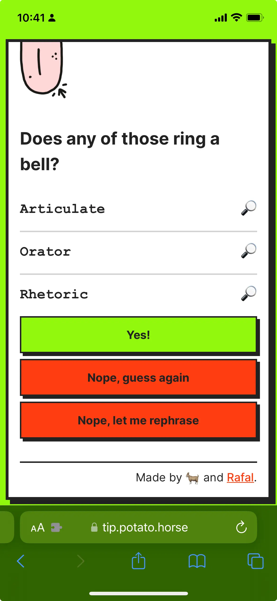

As I was walking Mango with Luna this morning, I remembered a video I watched last night: a 1960s [interview](https://www.youtube.com/watch?v=ouQB3CSn2YI) with a teenager who had a bunch of LSD trips and was forcibly admitted to a mental hospital by his mother. It struck me how eloquent, measured, and well-spoken he was, especially compared to the adults. Now, notice that I already used three different phrases to describe him here: *measured*, *well-spoken*, *eloquent*. Luna gave me these suggestions when I said that the word I was looking for was on the tip of my tongue.

So, I typed "tip" in Safari, opened up [Tip of the Tongue (TOT)](https://tip.potato.horse) , typed those three words and saw this:

*The irony of looking up "articulate" in an app called Tip of the Tongue does not escape me.*

Articulate! Fuck, yes! It feels so good to tickle your [Parahippocampal Gyrus](<../Parahippocampal Gyrus>), your [Broca's](<../Broca's Area>) and [Wernicke's](<../Wernicke's Area>) areas. You did it again, Potato Horse!

TOT is a really dumb tool: you describe the thing you can't name and it spits out a [guess](https://twitter.com/rafalpast/status/1676517556159492097?s=20). (related: [MISS – Make It Stupid, Simple](<../MISS – Make It Stupid, Simple>))

## Why am I talking about this?

It's 1 February 2024 — that's more than 6 months since I pushed this little experiment and I *still* keep coming back to it. This app could've been a custom GPT or a single prompt. I know it's trivial. So, why am I still using it?

### Some guesses:

**Because it's mine.**
**Because it's a toy.**
**Because it's pretty (in a way).**
**Because it doesn't feel like a chatbot.**
(It reflects how I think and feel.)
**Because I got attached to it when I was making it.**
**Because it's *still* easier, quicker to use than the Chat GPT app.** 
(TOT already loaded before I finished typing.)

I grew up above a carpentry workshop. I'm used to making my own toys. It's an old meme by now that developers are often tempted to reinvent the wheel, err on the side of building vs. reusing an existing solution. I'm guilty of that myself. I am that meme! 

But I don't think this is the case here. To me, coding vs. looking for a solution or asking for help often comes from fear — there's friction. The friction is related to social interactions, an irrational fear (often not verbalised) that people will realise that I can't do it, or that I won't even be able to learn how to use their solution. 

This feels different. There's no friction, but attraction — it feels fun to both make and use tools/toys like this. If I saw an app that looked like this, I'd use it because it speaks to me.

Personalising software used to be a deliberate process: I could choose my WinAmp skin or change the way my crappy Windows 95 desktop looked (I had a really old computer so I'd spend ages pimping it up.) A big part of what makes personalisation fun is, well, *making* it fun, putting in the work. 

I want more handmade objects in my life, whether they are physical or digital. [Future of Coding](<../Future of Coding>).

### Related:

- [Reactive Hole (sonnet.io)](https://sonnet.io/posts/reactive-hole/)
- [An app can be a home-cooked meal](https://www.robinsloan.com/notes/home-cooked-app/)
- [Ad Space Bodies](<../Ad Space Bodies>)

