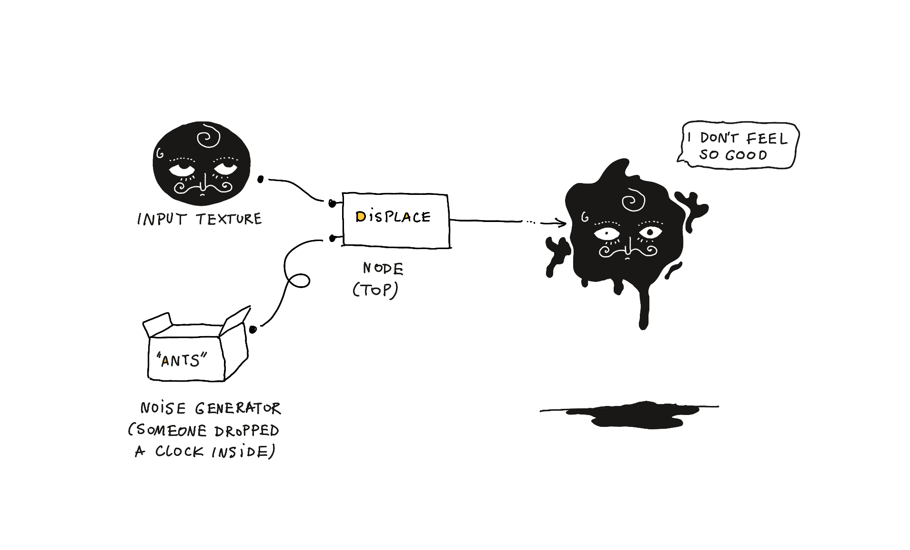

I noticed a bunch of posts [mentioning](https://twitter.com/tBlankensmith/status/1749684104289718346) TouchDesigner on social media recently. I had an hour to play with it this morning. Here's what I've learned so far.

TouchDesigner is a node-based visual programming tool used for interactive media installations, processing/p5.js style generative art, multimedia performances. I'm not a generative art expert, but from my perspective it sits somewhere between PureData and Processing.

It feels much more modern and than PureData, both in terms of UI polish and the feature set. Inputs such as Kinect or WebRTC are available out of the box. This means that with relative ease you should be able to control audio or animations with signals such as voice/movement/body pose. And of course a wealth of other high-level APIs (anything that can talk web).

TouchDesigner uses python as its scripting language of choice (compare this with Java in Processing and C/CPP externals in PureData).

## hello_world()
### Here's my first *hello world* TouchDesigner project:

<video src='https://res.cloudinary.com/dlve3inen/video/upload/v1706014592/movieout.2_arkgru.mp4' style='max-width: 128px; aspect-ratio: 1/1' muted autoplay playsinline loop />

### Here's how this works:

The 101 example added to each new TouchDesigner project is fine, but a bit too complex for a decaf Rafał with 1 hour to spare. So here's an intro ***I*** would've liked to see:  distort an image based on a noise value and animate the thing using time (so, show me how to access, pass and manipulate variables, then spit them out on the screen). 

1. we sample a noise value and use an offset based on the absolute time
	1.  `absTime.seconds * .1` is a python expression
2. we pass that noise value alongside a circle texture to a displace node
3. we pass the displace node output to the main output (connected to the display device)

### Interesting stuff:

- there are different types of nodes, depending on the use-case and the shape of data (e.g. TOPs textures vs. CHOPs for sequential/time based data)

## Here's something a bit more complex (no rocket science tho):

<video src='https://res.cloudinary.com/dlve3inen/video/upload/v1706014779/touch-designer_mck1yt.mp4' muted loop autoplay playsinline webkit-playsinline />
*Psst... the noise looks a bit funny because we're distorting the circle using cartesian coordinates instead of polar coordinates*

### Interesting stuff

- I had to save the previous project before starting this one. Every project is saved in a `*.toe` file. 
- In most graphics frameworks this effect would be achieved by "clearing" the canvas with a semi-transparent texture, so each frame would retain a bit of the previous picture, slowly fading out. In tools like TouchDesigner this is not the case -- there's no previous canvas state to clear. Instead,  we use a  [*Feedback*](https://www.youtube.com/watch?v=83K3QEK6Iv0&embeds_referring_euri=https%3A%2F%2Fwww.toolify.ai%2F&source_ve_path=MjM4NTE&feature=emb_title) node to retain the previous texture value and compose the previous texture with the next frame.

## Resources

[Comprehensive, beginner-friendly course](https://www.youtube.com/watch?v=xtp1CLzWRUk&list=PLFrhecWXVn5862cxJgysq9PYSjLdfNiHz&index=4)
[More advanced tutorial (check it for some demos/inpiration)](https://www.youtube.com/watch?v=rYs117xENP4)
[Noto the Talking Ball](https://www.youtube.com/@NotoTheTalkingBall) has a ton of fun and quick tutorials. I also just love the format, the style and the presentation here. It want wobbly space princess' cousin to teach me CS from now on.

Watch out for outdated tutorials. The GUI is quite minimalist and seems to have changed a bit in the past 3 years. This means that sometimes took a few minutes to realise that I needed to translate the instructions into the current GUI commands or just abandon the tutorial completely.
