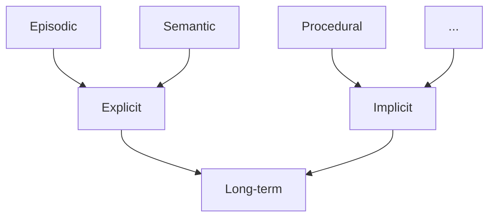

From [here](https://en.wikipedia.org/wiki/Episodic_memory).

### Do [dogs](<../Doggo>) have episodic memory?

[Possibly](https://www.psychologytoday.com/us/blog/animal-minds/201911/dogs-demonstrate-episodic-memory), they seem to understand the what-where-when components of [episodic memory](https://en.wikipedia.org/wiki/Episodic_memory).

