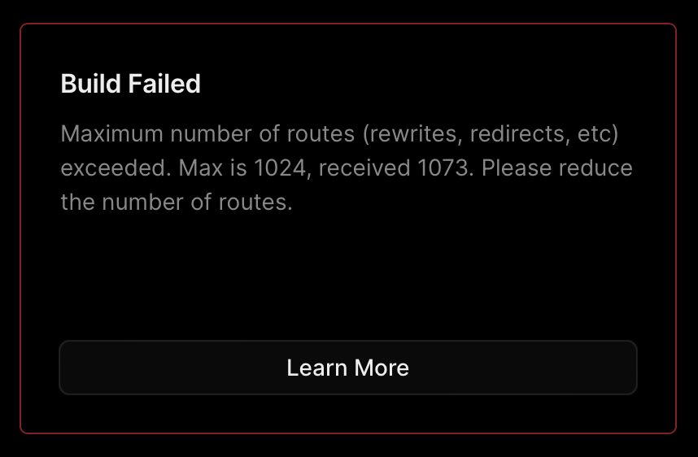

I like [SvelteKit](https://kit.svelte.dev/docs/adapters). It feels less magical than most other similar tools I've used in the past and it works really well with small-, and medium-sized projects. It feels pragmatic: it helps me avoid making the decisions I don't want to make (yet).

Still, from time to time I stumble upon a gotcha. This one has to do with Vercel, SvelteKit adapters and the [Medieval Content Farm](https://tidings.potato.horse).

Read [Medieval Content Farm and Procedural Cheese](<../Medieval Content Farm and Procedural Cheese>) for details. For the purposes of this post it should be enough to say that:

1. every morning a CRON job tells our "editorial staff" to query Wall Street Journal and turn its news stories into poems
2. those poems are then published as separate blog entries (e.g. [this poem by Brother Arnulfus](https://tidings.potato.horse/2023-06-17/arnulfus))

We have **4 authors**, each writing **at least one poem per day**. The site has been running since April 2023. This means that we should generate ca. **1400 stories per year**.

Now a month or so ago I started receiving these error messages from Vercel:



I was confused as I already used the Vercel adapter and set my pages to static using the prerender option:

```typescript
export const prerender = true;
```

Also the number of published posts was definitely lower than 1024.

## Approaches I tried:

1. checking the build output and the resulting Vercel routing config
2. switching to incremental server-side rendering (ISR)
3. giving up for a month
	1. ☝️👍

1\. seemed close, but I'd have to mess with redirects, possibly overly complex route matching rules. It smelled like one of those unnecessarily difficult, muddy problems with an annoyingly trivial solution.

## Here's how I fixed it:

1. I forgot about the problem
2. I worked on something else (*a static, self-hosted, personal alternative to Obsidian Publish attempted in a mad rush fuelled by a cascading stylesheet frustration and a serendipitous tweet*). Important: it used [@sveltejs/adapter-static](https://www.npmjs.com/package/@sveltejs/adapter-static).
3. Eureka: why can't publish the Medieval Content Farm in the same way?

### What was the problem:

The SvelteKit Vercel adapter creates separate routes for each static path, even with prerendering enabled.

Since I don't need to depend on dynamic routes in Medieval Content Farm, I could just switch to the static adapter, which will spit out all pages in HTML and serve them in the same way as all static assets. No fancy routing logic required.

```diff
++ import adapter from '@sveltejs/adapter-static';
-- import adapter from '@sveltejs/adapter-vercel';
```

## Summary

- When publishing static content on Vercel using SvelteKit, start with [@sveltejs/adapter-static](https://kit.svelte.dev/docs/adapter-static)
- **If you're stuck and the problem seems weirdly difficult, take a break, fuck around and build something else. Let's call this methodology [Doom-driven development](<../Doom-driven development>).**

