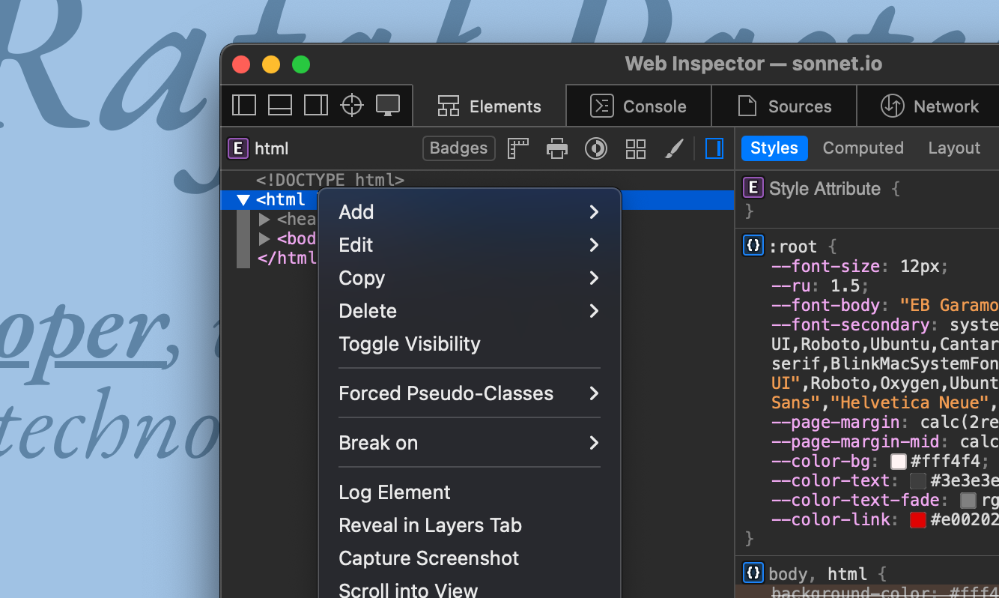
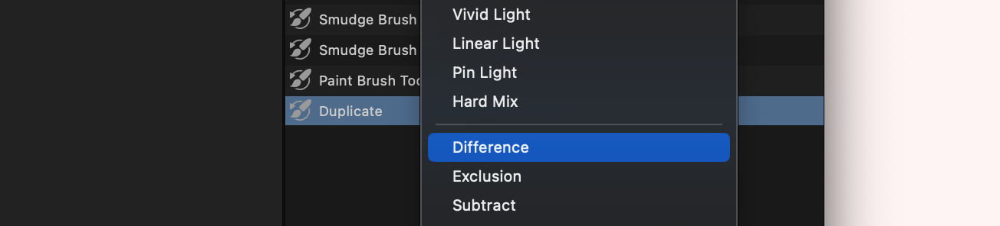
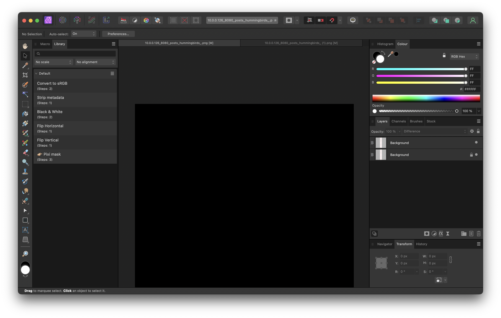
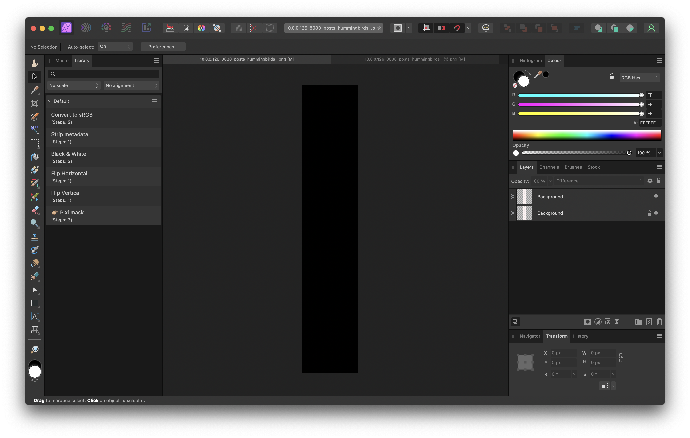
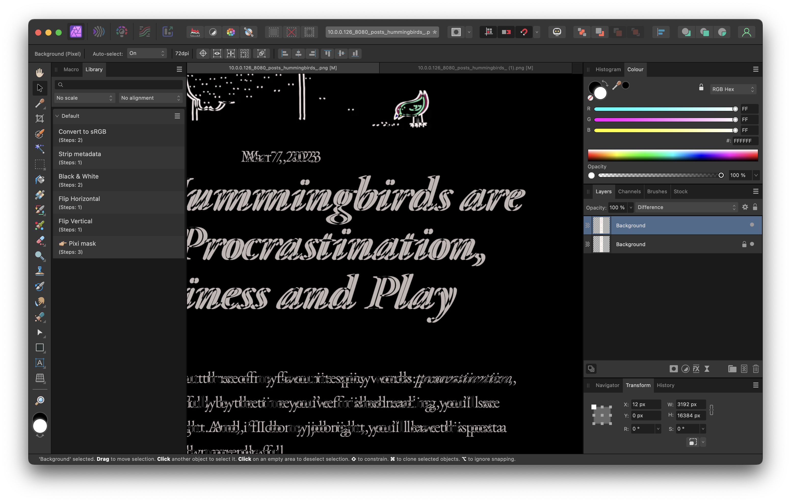
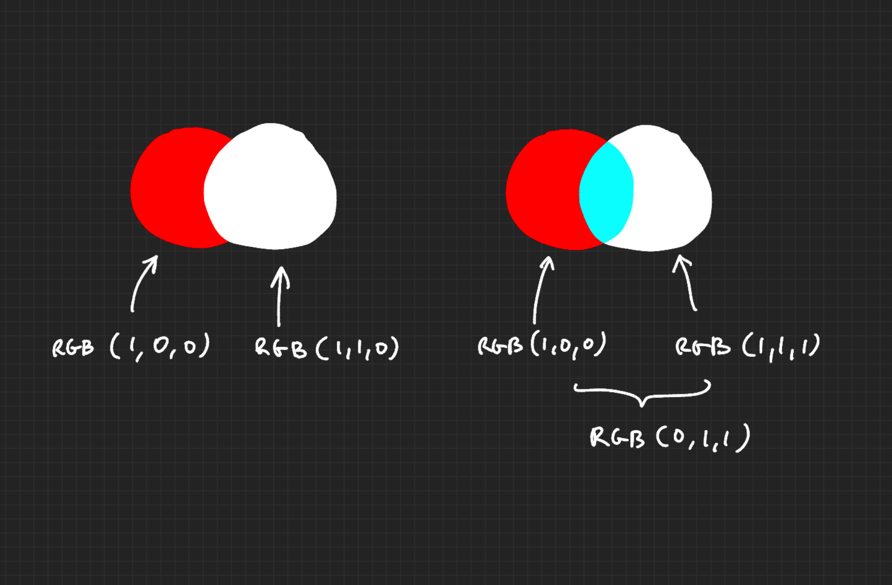
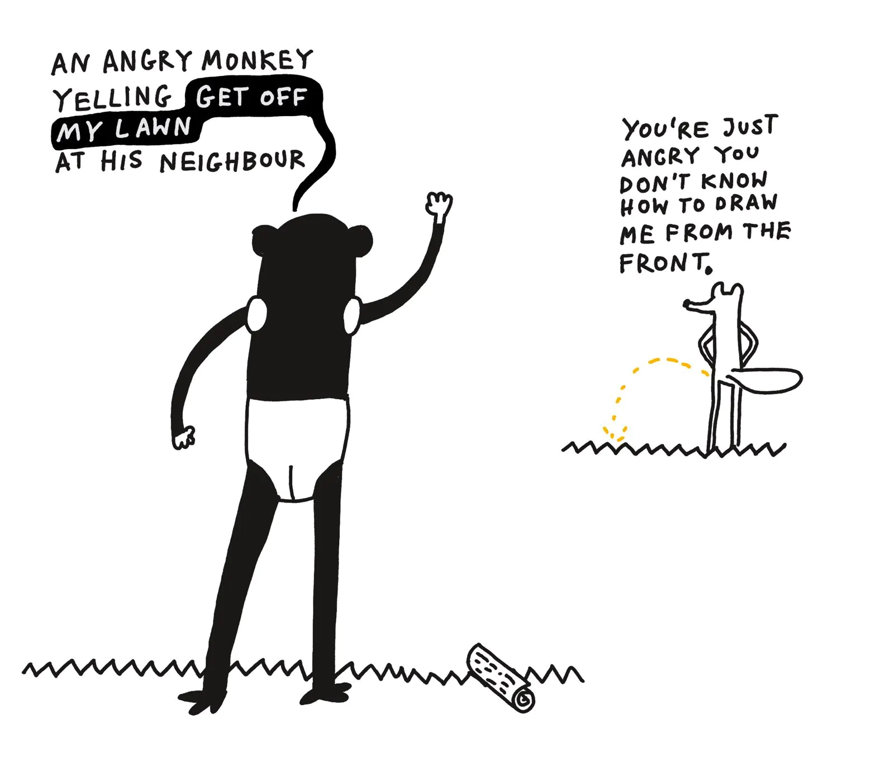
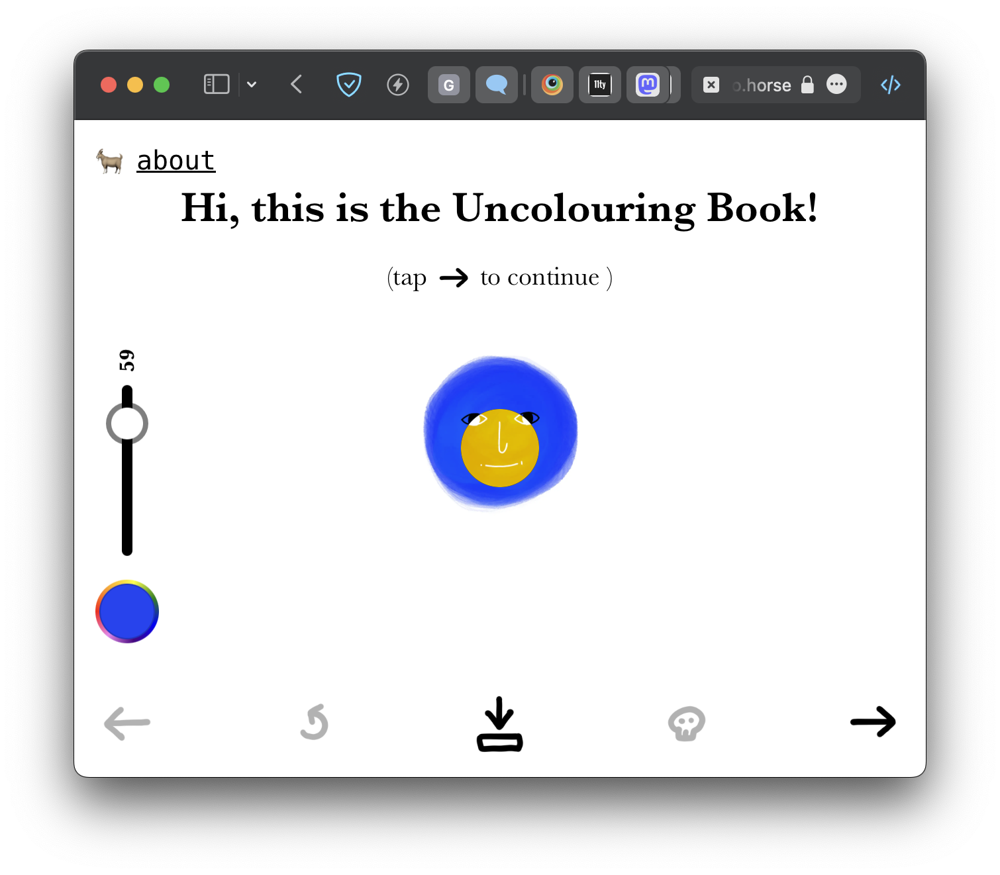

My main website is published using [11ty](https://11ty.dev). I try to keep it as "low-tech" and close to the bare web platform as possible. There are three reasons for that:

1. Frameworks come and go, but the foundations are still roughly the same. Invest in the foundations.
2. Having a more boring codebase makes it **harder** for me get distracted and yak shave.
3. Having a more boring codebase makes it **easier** for me to focus on writing.

The downside of this approach is that (for me!) sometimes it is hard to reason about the impact of my changes. It _feels_ like it's easy to break stuff. Mind you, there's nothing wrong with 11ty per se. This has to do with _my_ approach to _that particular project_.

When it comes to personal site I'm quite precious about the user-facing details, especially the typography. I try to keep the vertical rhythm correct, control the typographic scale, ensure that the drawings [load fast](https://100r.co/site/weathering_software_winter.html) but still look sharp. It's a bit overcomplicated, but it's my dirty pleasure.

Now, once or twice I had to make potentially breaking changes to the site and needed to run a quick [visual regression test](https://www.browserstack.com/guide/visual-regression-testing) to see if everything still looks fine.

But, as I already warned you in the title, I'm a cheap bastard and I want to be done with this under 2 minutes. I don't have time for [Percy and Playwright](https://docs.percy.io/docs/playwright).

## Here's what worked well:

1\. Open the old version of the page
2\. Take a screenshot:

(yes, you can do it in Chrome too, but [why](https://mastodon.cloud/@raf/111017064287821057))

3\. Open the new version of the page and take another screenshot
4\. Paste both screenshots into an image editor with layers (like Affinity or the ==next Paint==)
5\. Set the top layer blending mode to _difference_

If both pages are identical, you should see a completely blank canvas:

If there are any visual differences between the pages, they'll appear in the screen roughly like this:

For instance, in the example above you can see that the page has moved by a few pixels to the left.

You might ask: why would you bother with all of this pantomime if the user neither cares nor is able to notice the difference anyway? Also, who cares about keeping things pixel perfect?

The short answer is: I wouldn't. I don't. Excellent question, dear imaginary reader onto whom I'm projecting my insecurities. See you again tonight!

The slightly longer answer:

- Little regressions have a nasty habit of piling up. If I introduced a bug in an **untested** codebase, I'd like to deal with it when it's still fresh. [Code sober, debug drunk](https://sonnet.io/posts/code-sober-debug-drunk/)–if I realise that I'm spending too much time on fixing bugs, rather than writing, _I'll add tests_.
- It took 2 minutes of my life. If I had to do this repeatedly I'd use a different tool. For now it's overkill.

## How does this work?

The _difference_ blending mode, as the name suggests, calculates the difference between each component of a colour in a pixel.

I use it in two different places:

1\. to generate a nicer speech bubble in this drawing:

2\. to generate nicer brush size previews in [the uncolouring book](https://lines.potato.horse)

PPS. Note to myself: it was hard to pick a subject of the next post and balance usefulness vs. feasibility. The smaller the post, the easier it is for me to deliver something of acceptable quality. I time boxed selecting the subject to 2 minutes.

PS. I In the spirit of being comfortable with making mistakes, I decided to spend no more than 1 Pomodoro on finding the tool to publish these notes. I managed to do so with a simple [11ty template](). I'll think I'll move to Obsidian, however.

Links:

[Blending Modes Explained - The Complete Guide to Photoshop Blend Modes](https://photoshoptrainingchannel.com/blending-modes-explained/#difference)
