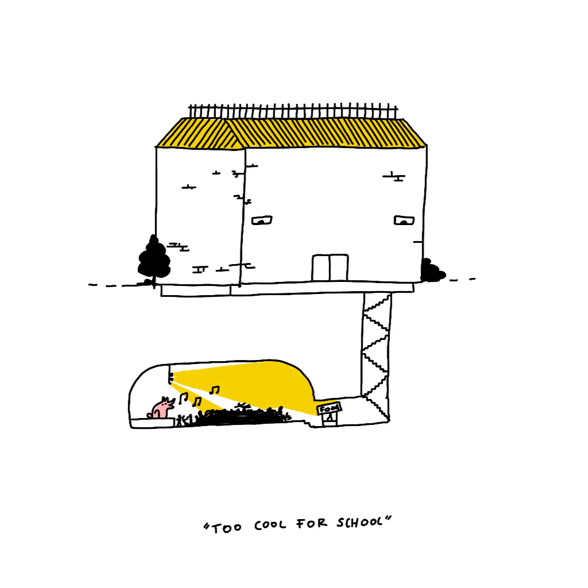

This note is biased, very personal and by no means prescriptive. It's not an opinion piece on CS education itself.

Here's how to read it: imagine you're having a ~~beer~~ [delicious nocturnal cheese toast](https://www.youtube.com/watch?v=OJOZFKwN1qg) with a friend. They're sharing their experiences, likely in an overly verbose way. Some parts of their story might resonate with you, some won't. And, that's ok! The toast is delicious. Your hands meet on the last slice of this kimchi and cheddar filled goodness. It's so crunchy. You know that sinking your teeth in it would feel so good you'd start wondering if you're doing something illegal. Now, your *eyes* meet on the toast, this time in a tug-of-war. I think French people call this sport *frottage de fromage*, but I don't speak French, so can't guarantee I'm correct here. Your (once) friend wrestles the last slice out of your hand and runs away into perfect darkness making a squeaky, eldritch sound you've never heard before. You'll never see them again, and the only thing that's left are the crumbs on the chopping board. 

Here's a (work in progress) list of reasons why I didn't study computer science, and ended up immersing myself in a language and culture I knew nothing about:

**Software Engineering always felt like a "soft skill", a force multiplier rather than the main thing one should do.**

There's immense value in connecting software engineering with a different (almost any) niche. For me that niche involved languages. So, I picked linguistics and moved on to Oriental Studies (mainly Persian, plus a bunch of now dead languages). Suddenly an entire new world opened up to me.

**I was already working in tech, building things.** I didn't see much value in spending even more of my time doing that.

**I became disillusioned with "techie culture" (or my idea of it) very early on (2005-2006).** I find the mainstream discourse around startups somehow both macho and infantilising.

I love working at the cutting edge, but I also love small, primitive, "boring" software (see [Brutally simple](<../Brutally simple>), [Kind software](<../Kind software>)). This is not a contradiction–working at the cutting edge often means dealing with low-hanging fruit, and opening up new possibilities to the unwashed masses (myself included). This is also flawed logic: deep down I just didn't want to be like the people in tech seen as role models.

**I also felt that I didn't belong to my group of peers and internalised that feeling.** It was easy to follow a completely different path from my peers. That's not a good reason, and I think I was lucky.

**I already lived in a dorm filled with 150 boys and 4 girls.** Honestly, I felt that it was not only boring but also plainly unhealthy. In hindsight, I might've overcompensated for that when I ended up being the only boy in my group at uni.

Finally, I was *going to say* that I had worse professional experience when working with graduates vs. people at the same age, who were self-taught... but the truth is I just caught myself making this up because:

- this happened 3 years later, and
- because of [creeping determinism](https://en.wikipedia.org/wiki/Hindsight_bias) 

The bottomline is that:

1. Our memory is brittle and if *feels* so cosy to know we were right all along!
2. Most 35 year olds I know still don't know what to do with their lives, so expecting this level of self-awareness from 18 year olds is almost cruel.

Thanks for reading, and see you tomorrow!
