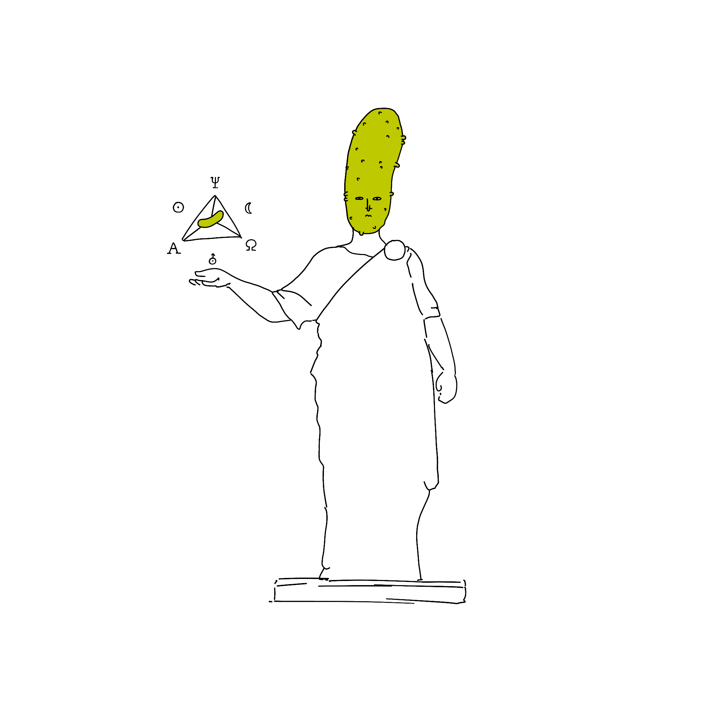

### ...on death!

Three `<blockquote>`s walk into a bar:

> *Whereof one cannot speak, thereof one must be silent.*
> – [Wittgenstein](<../Wittgenstein>)

> *Death is not an event in life*
> – [Wittgenstein](<../Wittgenstein>)

> *What is, is. What is not, is not*
> – [Parmenides](<../Parmenides>)

>  *I'd go with Wittgenstein. He was right about the [hotdog](https://existentialcomics.com/comic/268).* 
>
>  *Having said that, we're not creatures of reason, and perhaps this is not a question about the limitations of human language, but the boundaries of our understanding. I don't see an indisputable reason to be afraid of death: I'm scared of dying and others being impacted by my death. I can only miss myself when I'm alive, but I am alive. I am very intelligent. Also, I'm a cheese. I am cheese. A cheese is a cheese is a cheese.*
> – Parmesan

Related: [Days](https://days.sonnet.io)