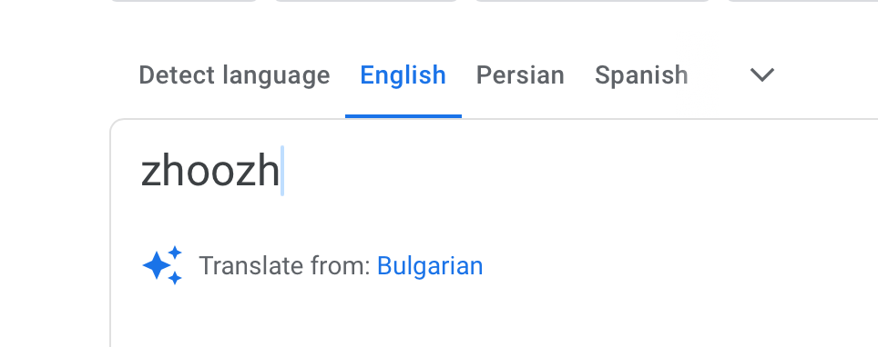
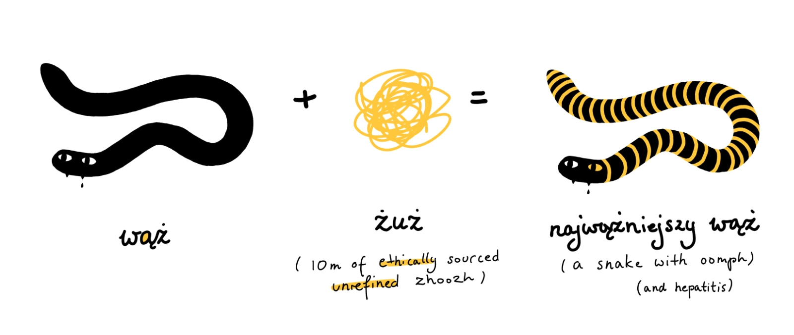

I was today years old when I learned that *zhoozh* (/ˈʒʊʒ/) comes from [Polari](http://www.polarimagazine.com/bulletin-board/polari/). *To zhoozh* means *more* than *to improve*, it means to improve by adding that little something special™. I use it exclusively when talking about soups.

Different competing ways of spelling it exist: *jeuje*, *jush*, *zhoosh*.

However, I still think that we should adopt the Polish way here: *żuż*. It's short, it's phonetic, it has two cute little eyes, it's something I can show to my UK-born friend next time he repeats his joke about the liberal use of consonants in Polish. *They're free*, Giles, they're *free*, it was the 20th century geopolitics that made our economy suffer, not the fact that we're consonant floosies! ^d876ce

At the same time, perhaps *jeuzhe* should be that one special zhoożed up word that has no established way of spelling. Instead of fighting stupid wars about gifs and jiffs we could embrace the cold tungsten-solid truth that no one really knows: what the true spelling of *jüj* is, where do all of those letters come from and what's their agenda. Do they come in peace? Can we trust them? Have I spent the past 5 hours trying to fix and reverse-engineer a 3 year old Unity project while waiting on the line to file my tax return for a country I'm not a resident of and I feel like I haven't learned anything today?

Yes, but I don't understand how this is relevant. I feel like you're not paying attention.  Now, imagine this prescriptivist nightmare: we don't only *allow* for all possible ways of spelling *żooozh*, but we *insist* that every time we use it, it *must* be spelled differently. No two *rzusz-eš* are the same. Every single one is unique, ژوژ-ed up above and beyond the previous one. You can mix languages, writing systems, you can even use [Asemic Writing](<../Asemic Writing>) as long as the shape and rhythm of your creation conveys the essence of its meaning: the improvement, the excitement, the öömph (uttered with a deep voice by a steam bun-faced bald man with a handlebars moustache and a hand tied bowtie).

Now every time you see a word you don't understand, for a brief moment, less than a blink of an eye, a few neurons in your Fusiform Gyrus or Wernicke's area will misfire and trigger the exciting question: is this *jeuje*? Are we *zhoozhing* here? Am I getting excited?

Reference:

- [‘Jeuje,’ ‘Zhoosh,’ ‘Zhuzh’: A Word of Many Spellings, and Meanings - The New York Times](https://web.archive.org/web/20231013223912/https://www.nytimes.com/2022/01/31/style/jeuje-zhoosh-zhuzh.html)
- [Zhuzh Definition & Meaning - Merriam-Webster](https://www.merriam-webster.com/dictionary/zhuzh)

