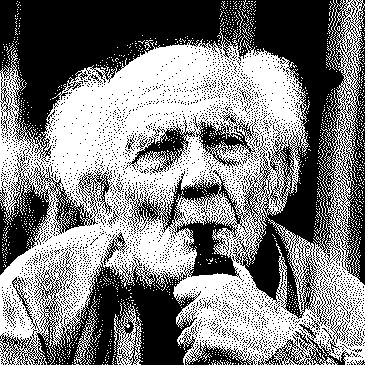

> Zygmunt Bauman (/ˈbaʊmən/; 19 November 1925 – 9 January 2017) was a Polish-born sociologist and philosopher. He was driven out of the Polish People's Republic during the 1968 Polish political crisis and forced to give up his Polish citizenship. He emigrated to Israel; three years later he moved to the United Kingdom. He resided in England from 1971, where he studied at the London School of Economics and became Professor of Sociology at the University of Leeds, later Emeritus. Bauman was a social theorist, writing on issues as diverse as modernity and the Holocaust, postmodern consumerism and liquid modernity.

## References

[Zygmunt Bauman - Wikipedia](https://en.wikipedia.org/wiki/Zygmunt_Bauman)
## No one is in Control

- uncertainty
- power and politics
	- used to be one (nation state)
	- now power is global (cyber)
	- politics is local

To see:

- The Swedish History of Love

