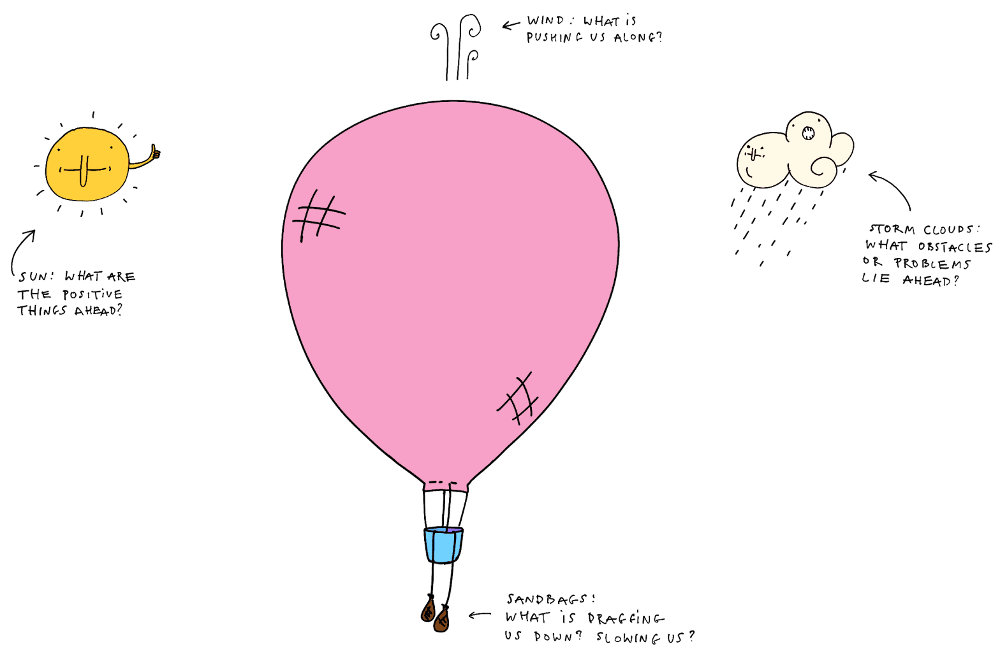
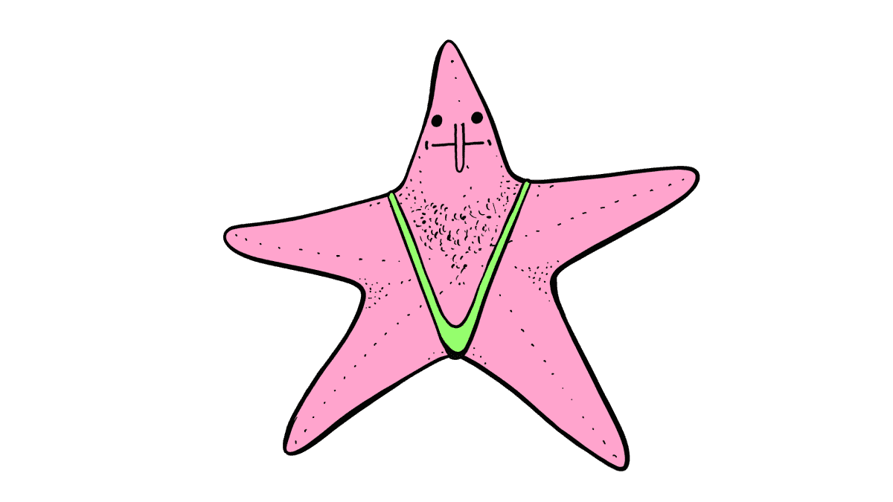

Happy Friday! Today I will: 

- summarise what I've learned in the past two weeks
- adjust and plan the next steps
- make sure there's something for you to learn (or just tickle your curiosity antennae)
- finish the thing in 1 hour

psst. If you were looking for some mildly cursed retrospective templates, [here](https://sonnet.io/posts/hot-air-balloon/) you [go](https://sonnet.io/posts/hot-air-balloon/)

I'll start with the last bullet point. I want to finish writing this post in under 1 hour because I have already spent 2 hours drafting 3 other posts. I think you'll like them, but I don't know how to slice them into smaller chunks.

## What I liked:

- **Having to sit down and write every day about something I'm passionate about.** 
- **Using my own voice.** Being able to share knowledge wrapped in a tiny story, be it an anecdote about clowns or carpentry in central Europe. Call it a product development [dolma](https://en.wikipedia.org/wiki/Dolma), or [sarmale](https://mostly-greek.com/2019/04/25/traditional-romanian-cabbage-rolls-sarmale/), or like Poles and Lithuanians call them: a [pigeon](https://aniagotuje.pl/przepis/golabki-tradycyjne)!
- **People are kind.** People message me, telling me that they enjoyed my work, sharing articles they thought I would like. The balance between sharing information and telling stories seems to work really well.
- **Not having analytics installed.** I didn't expect that one. I thought I didn't care about this sort of thing anyway.
- **Being more liberal with illustrations** (on sonnet.io I'm quite precious about the drawings, most of the content needs to suit the subject matter, there's a tonne of little hidden jokes)
- **Having an ugly website template**, in a strange, BDSM-like way just letting it go feels so good. Less NSFW metaphor: it's like learning to take cold showers. Eventually the discomfort fades away and turns into pleasure.
- The feeling when after a few hours of work, all the pieces suddenly fall into place, seemingly out of nowhere.

## What I didn't like:

- **Having to rush** when writing. Rushing kills creativity. I've been writing ca. 3000 words per day and I'm not even half as handsome as Kerouac.
- **Feeling like I will stop enjoying it.** I stopped enjoying coding for almost 3 years due to work stress, burnout, and depression. I've already learned the lesson that it's better to listen to yourself.
- **Not having enough time to read.**
- Using a linear blog format (at least not always).
- **The current publishing workflow.** It's distracting. I went for simplicity, but these tools have too many yaks to shave and I'm already tired of typing like a Baz Luhrman montage scene. Also, the high-performance 11ty template takes 3 minutes to build. Obsidian or Svelte would take 10-30s. It makes fixing typos annoying. Bear in mind, I've worked on/built publishing pipelines used by publishers with 100,000s of readers. The irony of this  does not escape me.

## What I've learned:

- **That I don't want to think or write in a linear fashion.** Most of my notes are in smaller, interconnected chunks (think: Weinberg's fieldstones, or evergreen notes). I feel like both the quality and quantity of the stuff I could put here suffers when I compose my notes into longer posts set in stone. I can't update them easily, I have to make the same point twice. It just takes so much time and feels so wasteful. 
	- I admire the approach of [Manuel Matuzovic](https://techhub.social/@kirbstr/111148950526108155) who decided to spend 100 days writing and posting every single day. However, his content (CSS/accessibility tips) lends itself more easily towards this kind of endeavour. It's not that he  writes about easier problems, but that I'm using the wrong tool for the job.
	- A more natural approach for me is sharing my research notes in their original shape. 
	- I will write a note about this, so I'll keep it short: if you enjoy going down wikipedia rabbit holes, then you'll love reading digital gardens. Writing in this manner gives me a similar pleasure, and I think this will come across.
- **That my ideal publishing platform is *Obsidian Publish... to a folder*™**, so I can style content myself. 
- **People seem to be more likely to interact with the content here, than on sonnet.io!** I suppose this is nothing new: people are more likely to interact with messy prototypes. Polished work often doesn't invite feedback, messy work is an invitation to play. Polished vs. messy prototypes -- let me break your toy 
- Did you see the `[[]]` above? That's a wikilink. You could use those to jump between notes,and to read the text at the level of detail you prefer. It's fun!
- That it became easier for me to just sit down and write, but the **new obstacle is to stick to the deadline I gave myself**.

**Next steps:**

- I will move this site back to a digital garden format.
	- And I will accept the limitations of Obsidian Publish for now. (read with the voice of a child agreeing unwillingly)
	- (The ideal I aspire to is somewhere between sonnet.io, [Maggie Appleton](https://maggieappleton.com) and [Ralph Ammer -](https://ralphammer.com))
- **I will still post at the same rate.** In fact I expect my output to increase in quality and quantity; quantity of ideas, not words, mind you.
- I will still post, *post-like* notes and little bits of stories or trivia. I mix those with my own notes anyway. I talk to myself a bit.

The last few days felt like a one giant hackathon. I love hackathons, but I don't like the ones where you build something that is just too big to be finished in the time you have, so you spend the last 30 minutes scrambling to fit a whale into a sardine tin. You see? When I'm tired I come up with metaphors like this. What if I tell people it's a Basque-Portuguese proverb? They might put me in a francesinha!

Thanks for reading. See you on Monday.

---

### Screenshot

> Attaching original post I was supposed to push here. I'm attaching it to illustrate the problem with my approach. Consider it a screenshot. Feel free to skim it, but don't worry about reading it!
> 
> I mean it, last week I started with product development and ended up with a post titled: "A Science Fiction Novel Set in a World where everyone was still using Internet Explorer". I don't want to hurt you. 

---

Open draft

Preview Screenshot
Just a reminder (especially to myself), this post will be quite superficial in nature. If you want to dive deeper, there will be a longer, more in-depth post on sonnet.io. Feel free to drop me a line or Come and Say Hi!

[#008 Things I build for my own well-being](https://untested.sonnet.io/posts/008/) focused on the things I've built for myself to improve my well-being. This post will focus on the present and the future: the stuff I'm actively developing and hope to eventually share.

First, why kind and what's kind software? Here's a working definition:

Kind software is the one that supports my own well-being. It doesn't get in my way, it doesn't try to extract value from me. Its purpose is to help first and be sustainable within my own means (time, attention, money). 

## Wishlist

(I'll come up with nicer names, I promise.)

### Mental health Toolbox

An app with a list of tools you can reach out to when distracted, feeling down, stressed, anxious, low on motivation. It's highly personalised and co-created together with the user, so details will vary.

It's very low-tech. In fact you can imagine it as a deck of Pokemon/MtG cards, where each card is a thing you can *do* or *think of* to get out of your head and respond to whatever challenge lies ahead of you, constructively.

Examples: 

- when I feel stressed or that I'm rushing, I draw a card telling me to pet my dog. 
- when I'm distracted and noticed that I'm wasting my time on HN, I read a random Wikipedia page, or someone's digital garden (both are beautiful rabbit holes)
- when I'm feeling down, I give my partner a hug

In a sense this is a deck building game, where instead of cards you collect (or create) new tools to work with and shape yourself.

Inspirations:

- [Hyper Island Toolbox](https://toolbox.hyperisland.com) (problem-based discovery, ignore the rest)
- Card games (classic or collectible/deck building)
- Tinder (card swiping UX)
- CBT
- cigarettes (especially nicotine addiction and how it implants itself as a trigger)

### Pickle

Pickle is not a timer, but a metronome for my attention. 

I'm **not** looking for a Pomodoro tracker. Most of them either have a surprisingly overcomplicated UX or try to be time trackers. I don't have time for that.

What I need is:

- adaptable work interval durations 
	- (e.g. longer in the morning and late afternoon, shorter in the evening)
- being able to start and stop the timer easily
- being able to switch to a "theme" (not even a task) easily
- (optional) record topics somewhere (text, file, calendar, notes)
- (optional) should be able to meow when the break ends (keeps my dog sharp and excited)

What I don't need is:

- time sheets
- to rate your app on the app store

Why not an egg timer or a mobile app? 

Egg timers are noisy and I don't work alone. My fingers are too big for the touch screen of my phone. Finally, egg timers generally don't meow. Otherwise, yes, I'd go full egg. I'd even meow at an egg like this [old Turkish man](https://www.youtube.com/watch?v=aRsWk4JZa5k).

Random trivia: 
Manichaeans (including one of the Catholic Church fathers–St Augustine) used to consider cucumbers sacred? Melons and *cucumbers of light* would help liberate the soul from the body. 

My ambitions for the humber pickle are just that, humble.

### An everything canvas

This is big and more people are working on one or another facet of this problem, so I'll keep it relatively high-level.

Imagine an infinite canvas that doesn't operate on images, text, media, but *objects*. An object could be static like a media file or a piece of text, but it could also be a small computer program, or a primitive dealing with transforming information.

Examples of objects:

- a note with a single word
- a picture
- an audio file
- a *thing* that arranges its content in a grid
- **a *thing* that given text returns a summarised version of that text**
- **a *thing* that looks like a queue with an input and an output**
- **a *thing*, an *NPC* who walks around the board and adds questions to your notes** 

Steve Ruiz, the author of tldraw, said that infinite canvasses are a bit like 2D games where you move the camera. I think he hit the nail on the head here. 

When I hear that metaphor what I think is RTS games:

- borrowing certain RTS UX primitives, e.g. selection, camera panning
- managing information amount and density (fog of war, LoD)
- NPCs (perhaps as Matt Webb's [Dolphins](https://twitter.com/genmon/status/1697261981814985139))

Stephan Nago talks about turning ideas into objects and I imagine that this is at least partially where they'd like to go with the Obsidian canvas. I also like that they use files as the base primitive. 

But, I also think that we can go one step farther and merge a canvas with a programming environment, without letting people know they're programming.

When it comes to computing, everyone focuses on Moore's Law, whether more interesting trends are: gradually increasing abstractions and shortening the distance between user intent and the result. 

Inspirations:

- Mother of All Demos (of course)
- N8N
- Figma, Miro, Mural and all their cousins
- Obsidian

### a better voice recorder (for slavic-language accent-challenged people)

