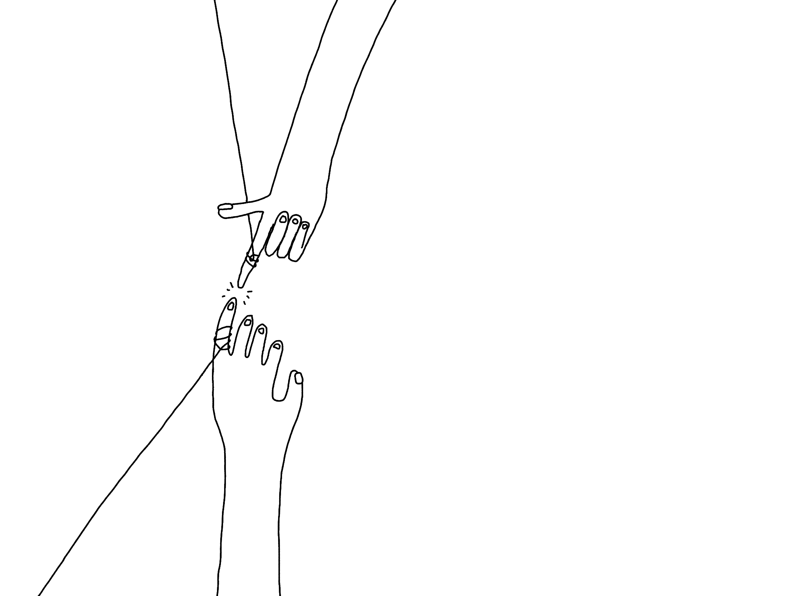
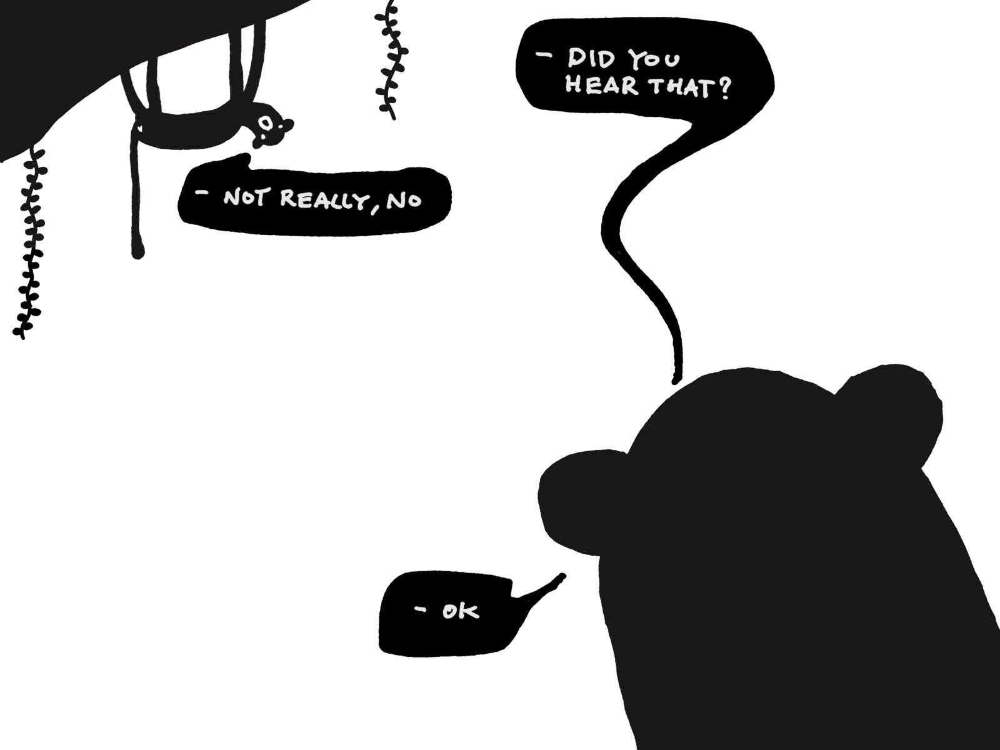

What do I (want to) mean when I say _I understand_ something:

**That I can communicate it:**

- that I can verbalise it
- that I can communicate it using images
- or a dance routine
- that I know when to use which.

**That I'm aware of the gaps in my knowledge:**
Even if I can't list all of them (I can't), I have a good enough knowledge of their quantity, size, and shape.

That, for the lack of a better phrase, my _body_ knows it: **I've internalised the knowledge or at least I know which parts of the idea I want to internalise.**

One can understand things from the epistemic point of view (i.e. cause and effect), through their relationships with other things, through sharing an experience (phenomenology), or through empathy.

The last two items need more attention, as they're less obvious. You need to be in someone else's shoes, or feel (the good, the bad, the ugly) with someone to understand them. Once when I was hugging a friend I thought I'd never see again, their hand squeezing mine told me more than any language I can write in.

**That I understand an idea at multiple levels:**

- being able to explain it to a child
- being able to explain it to a client
- being able to navigate the nuance
- knowing when to use the right level
- knowing when to listen

**In this sense, how well I understand something is only as relevant as how much I can apply it to my environment. It's measured always in relation to something or someone.**

The same applies to design or software engineering (good software engineers are designers in denial). 99%\* of the time when I struggle to come up with a solution it's because I don't understand the problem or the user. Shame that 1 is such a small sample group because it's so much easier to build apps for myself!

[\*] That 1% I reserve for setting up a Node.js project for the billionth time and then typing with my hands upside down so I can facepalm faster.

### So what do I say when I say I understand:

- that I understand (sometimes)
- that I want to understand (sometimes)
- that I think I understand (too often)
- that I put together a bunch of things, painted little handles on them, and now their shape looks familiar!

If [ideas are objects we can manipulate](https://stephango.com/evergreen-notes), then understanding means figuring out how to put them together.
