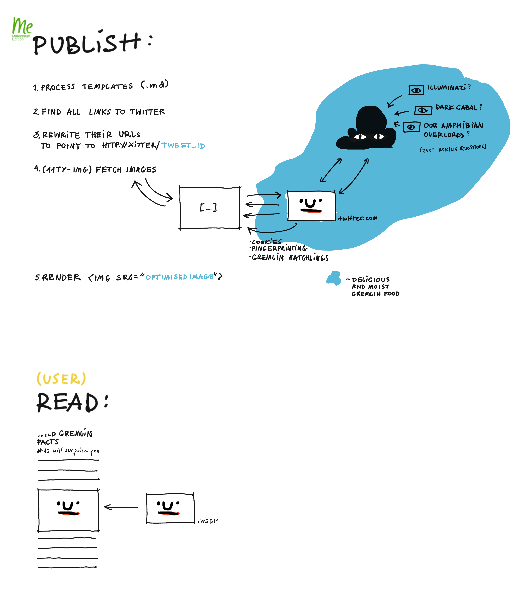

Hi there! The new site's up, standing on its three (mostly finished) and one (slightly wobbly) leg. I'll continue working on it and share what I've learned along the way. Enough with intros and [disclaimers](<../Disclaimer>). This site is [the Snail of Theseus](<../the Snail of Theseus>) after all. Let's goooooooo!

## What's xitter.png

xitter.png is what I use to embed tweets on this site with respect for your privacy. By that I mean that none of the reader data is shared with the ~~social network~~ ad platform. 

Think of it as a one-way mirror. You can see the doomsday gremlins, but the gremlins can't see you.

## Why xitter.png

In short, [Don't assume consent](<../Defaults Matter, Don't Assume Consent>).

### Slightly longer version

I don't like Twitter. The reasons are many. The one I'm tackling here is this, phrased as an edgy joke from 2003: 

> In Soviet Russia, Internet browses you!

(Another variant replaces *Soviet Russia* with *Internet Explorer*, but you get the picture)

Say, you're scrolling through an article listing 10 best dressed possums. You look at the embedded tweets from crème de la crème of the Didelphimorphic fashion community. You glance at a picture of a possum wearing a colander.  Slowly, and quietly at first, a sense of envy crawls in on it's tiny, weirdly soft, weirdly human-like paws. 

Fine, you already expected to feel that way. But what you probably didn't expect, that when you gaze at a tweet, the tweet gazes back:

What happens behind the possum is akin to loading an ad widget: yes, a tweet is displayed, but also a bunch of metrics about you is sent to the parent domain, then directly or not, those metrics are shared with a bunch of third-parties. 

The data can include a fingerprint of your device, cookies or anything that can be used to build a targeting profile. And that profile is then used to tell you to buy shit you don't need. This is generally achieved by finding ways to make you angry. 

## How it works

### Short version

[Nihil novi sub sole](<../Nihil novi sub sole>): replace Twitter embed widgets with screenshots of embeds and a link to the tweet. Tweets/screenshots are generated on my machine when the content is published.

### Slightly longer version

Here's how embeds are processed and displayed normally (I split it in two parts: *reader* and *build*):

And here's how it works with xitter.png enabled:

{.embed--wide}

The main difference in the second case is that most of the interactions that are normally handled when a tweet is *displayed* (incl. tracking) happen server-side, during build.

The code is pretty rudimentary ([MISS – Make It Stupid, Simple](<../MISS – Make It Stupid, Simple>)). Here's the [source](https://github.com/paprikka/xitter.png/blob/main/main.js).

1. Embed tweets in Obisidian using regular links:
   ``
2. use a markdown-it plugin to transform images pointing to twitter.com as `http://<xitter.url>/<tweet id>`
3. when an image is downloaded during build, xitter.png
	1. starts a web browser
	2. loads the shared tweet
	3. takes a screenshot of the tweet
	4. returns an image
4. a screenshot of the tweet is saved in cache and added to the output

### Limitations

This works surprisingly well, but only locally or at a small scale. I don't expect it to work hosted from an EC2 instance and used by hundreds of people, due to bot/scraping prevention tools used by Twitter. At the same time, I haven't tested it yet. 

I did, however add basic API key support before realising *I didn't need it*. So, feel free to run it from the cloud and [let me know](mailto:hello@sonnet.io) how it went!

## How I made it

I wrote the scaffolding with 2-3 Claude Sonnet 3.5 prompts. Then I fixed the nicely polished gibberish using a paste made of my prefrontal cortex and basic programming skills.

### Reasons for this approach: 

- using puppeteer for screenshots and web scraping is quite common
- those scripts tend to be repetitive
- I already had the structure of the script in my head. 

Enough training data, a relatively simple problem structure and enough personal experience to use bullshit detectors effectively makes this one of the cases where LLMs can speed up work (related [LLM-powered Tools I'm Actually Using](<../LLM-powered Tools I'm Actually Using>)). 

## Why I made it

I don't share tweets that often. I probably could've just manually copy-pasted the screenshots into my notes. The reasons I'm *sharing* xitter.png are different from the reasons I *made* it:

- I needed a break from another task. My thought sponge was tired and I felt like I wasn't moving in any direction. I needed a quick snack to give me a sense of progress.
- Having to manually add screenshots to a page doesn't take much time but it gets me tired very quickly.

I bought shoelaces in Shoreditch once and after I paid, the seller asked me if I could give them my email address. I think it's creepy that this attitude towards our privacy has become normalised. 

If just a single person reads this and adds something similar to their site, or even considers the idea of doing so, for me that's still a win, and a real source of satisfaction.

## Next steps, ideas

- **try this out on Vercel**
- **turn this into an 11ty plugin**
- **turn this into an Obisidian plugin** 
  Obsidian Publish is great, but one of the reasons I moved away was limited control over embeds and images, related: [Abusing and reviewing Obsidian Publish](<../Abusing and reviewing Obsidian Publish>), [How to optimise images for Obsidian Publish](<../How to optimise images for Obsidian Publish>), [How I Use Obsidian to Publish These Notes](<../How I Use Obsidian to Publish These Notes>)

If you have a problem or use case for xitter.png, [let me know](mailto:hello@sonnet.io)!

## What I've learned (or want to remind myself of)

[express.js](https://expressjs.com) is (still) amazing. It's simple, intuitive, stable, it doesn't get in your way. [Express is the CSS of web frameworks](<../Express is the CSS of web frameworks>). 

I tend to judge myself when I don't stick with a task, when I feel stuck. This is perhaps the opposite of [Dog mode](<../Dog mode>). Judgement or guilt are terrible ways of looking at this. It's unproductive and distracting: sometimes I need more focus, oftentimes (more than I think) I need to take a break and clear my head, and finally – sometimes I just need to distract myself with another task so I can feel that I'm moving, feel more hungry, curious. 

What works better: figuring out why I'm stuck, why I feel that way. Then I can move on and act. [Hummingbirds are Evil!](https://sonnet.io/posts/hummingbirds/)

Thanks for reading this, see you soon!